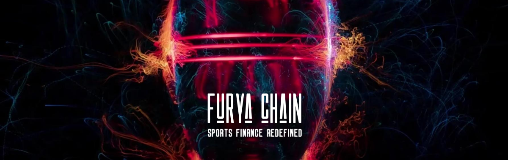

# Furya  

Furya is a Cosmos SDK based blockchain here to enhance Web3 individuals, communities & builders experience through an all-in-one hub of dApps.  

# Testnet  

## All the testnet chains:  
[*DEPRECATED*] - [furya-testnet-v1](https://github.com/FURYA/furya-chain/tree/main/testnet/furya-testnet-v1)  
[*DEPRECATED*] - [furya-testnet-v2](https://github.com/FURYA/furya-chain/tree/main/testnet/furya-testnet-v2)  
[__ACTIVE__] - [furya-testnet-v3](https://github.com/FURYA/furya-chain/tree/main/testnet/furya-testnet-v3)  

# Mainnet  

## All the mainnet chains:  
[__ACTIVE__] - [furya-1](https://github.com/FURYA/furya-chain/tree/main/mainnet/furya-1)  
